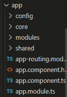
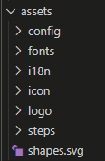
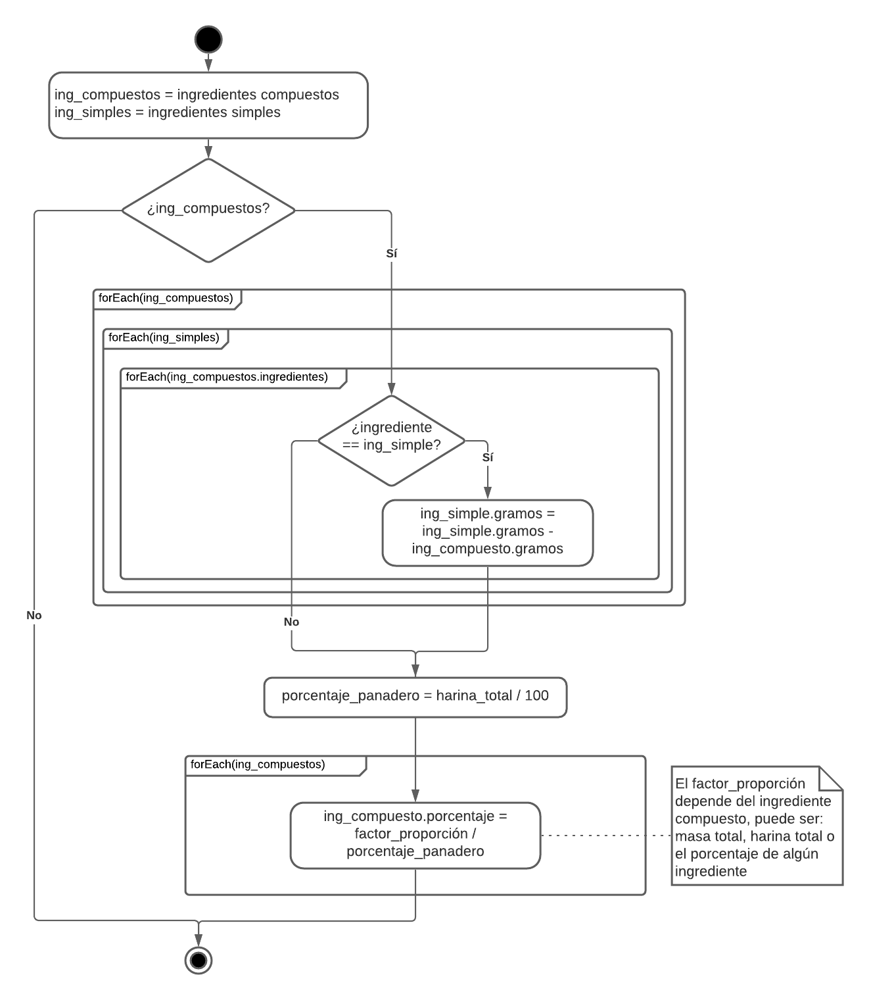
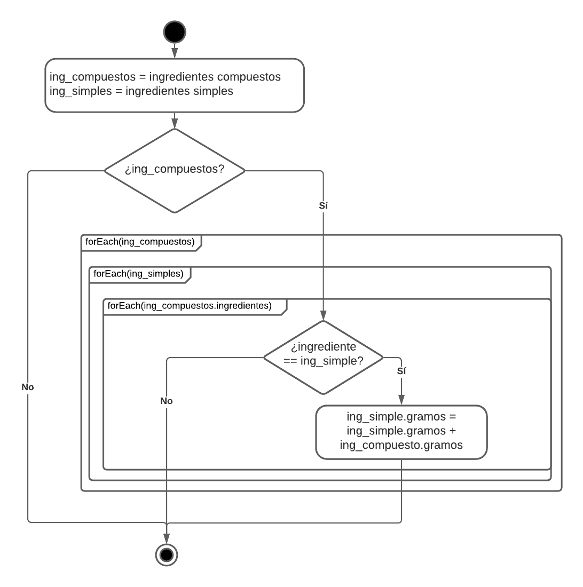
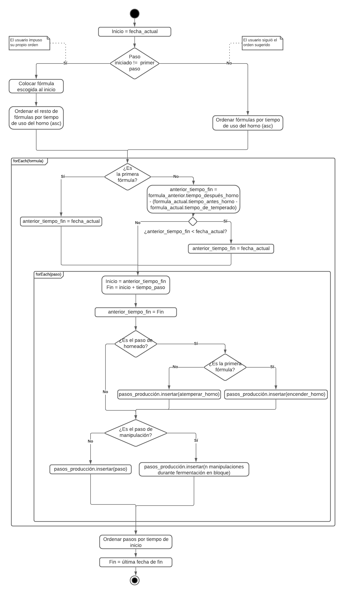

# Haz pan en casa 🍞

<h1 align="center">
  
</h1>


**Haz pan en casa** es una herramienta de trabajo para la producción panadera y optimización del uso del horno.

## Documentación 📖

---

### Tabla de contenido

- [Documentos de interés](#documentos-de-interés)
- [Estructura](#estructura)
  - [/app](#app)
  - [/assets](#assets)
- [Algoritmos](#algoritmos)
  - [Agregar prefermentos](#agregar-prefermentos)
  - [Eliminar prefermentos](#eliminar-prefermentos)
  - [Algoritmo de maximización de uso del horno](#algoritmo-de-maximización-de-uso-del-horno)
- [Configuraciones](#configuraciones)
  - [Configuración de idiomas](#configuración-de-idiomas)
  - [Configuración de clasificación de fórmulas (hidratación)](<#configuración-de-clasificación-de-fórmulas-(hidratación)>)
  - [Configuración de tiempos de horno](#configuración-de-tiempos-de-horno)
  - [Cambio de moneda](#configuración-de-moneda)
  - [Cambio de página principal](#configuración-de-página-principal)
  - [Cambio de formatos](#cambio-de-formatos)
  - [Cambio de imágenes](#cambio-de-imágenes)
  - [Cambio de ícono y splash screen](#cambio-de-ícono-y-splash-screen)
- [Autor](#autor)

### Documentos de interés

- [Propuesta de pasantía](https://github.com/synergyvision/formulapanadera/tree/master/docs/propuesta) -
  _Este documento contiene la descripción del proyecto, junto a sus objetivos, limitaciones y alcance_
- [Diagramas del proyecto](https://github.com/synergyvision/formulapanadera/tree/master/docs/diagramas) -
  _Esta carpeta contiene los diagramas de los algoritmos más relevantes de la aplicación_

### Estructura

#### app



- **config** - _Contiene archivos con constantes que afectan la configuración de la aplicación_
  - **assets** - _Contiene las rutas a las imágenes utilizadas en la aplicación_
  - **configuration** - _Contiene variables de configuración, entre ellas: lenguaje, moneda, página principal (primera página visualizada al hacer login en la aplicación)_
  - **firebase** - _Contiene los nombres de las colecciones a utilizar en firebase_
  - **formats** - _Contiene formatos de fechas, costos y valores_
  - **formula** - _Contiene datos de interés para una fórmula, entre ellos: cantidad de pasos de la panadería, tiempo de encendido del horno antes de ingresar un pan, estatus de un paso panadero en producción y clasificaciones de hidratación_
  - **icons** - _Íconos de la aplicación, utilizando [Ionicons](https://ionicons.com/)_
- **core** - _Contiene archivos que afectan a la lógica de la aplicación_
  - **guards** - _Contiene los guardias de navegación de la aplicación_
  - **models** - _Contiene los modelos de la aplicación_
  - **services** - _Los servicios contienen la conexión a Firebase, Firebase Auth y la lógica de la aplicación, entre ellos se encuentran:_
    - /firebase - _Contienen los métodos CRUD de las colecciones de Firebase y de Firebase Auth_
    - /storage - _Contienen los métodos CRUD del storage en el dispositivo, para manejar sesiones y guardar producciones en proceso. Utilizando el plugin Storage de capacitor/core_
    - servicios simples - _Contienen la lógica de la aplicación_
  - **validators** - _Contiene la validación de contraseñas iguales_
- **modules** - _Contiene los módulos de la aplicación, cada pantalla con su código html, scss y ts_
  - **auth** - _Páginas de autenticación en la aplicación (registro, login y olvido de contraseña)_
  - **formula** - _Páginas de fórmulas (listado, detalles y gestión)_
  - **ingredient** - _Páginas de ingredientes (listado, detalles y gestión)_
  - **production** - _Páginas de producción (listado, detalles, ejecución y gestión)_
  - **settings** - _Páginas de configuración de la aplicación (opciones globales y cambio de contraseña)_
  - **tabs** - _Menú de la aplicación_
- **shared** - _Contiene componentes que se reutilizan a lo largo de la aplicación_
  - **alert** - _Alertas de la aplicación (alerta de cambio de idioma)_
  - **components** - _Componentes compartidos globales y específcos de cada elemento de la aplicación (fórmulas, ingredientes y producciones)_
  - **modal** - _Modales (selección de fórmulas e ingredientes, configuración del orden de la mezcla y pasos panaderos)_
  - **shell** - _Text shell del [Ionic 5 Full Starter App](https://ionic-5-full-starter-app-docs.ionicthemes.com/)_
  - **styles** - _Estilos compartidos en la aplicación_

#### assets



- **config** - _Contiene la configuración del app shell del [Ionic 5 Full Starter App](https://ionic-5-full-starter-app-docs.ionicthemes.com/)_
- **fonts** - _Contiene las fuentes externas que serán utilizadas en la aplicación_
- **i18n** - _Contiene los archivos de los lenguajes permitidos en la aplicación_
- **icon** - _Contiene íconos utilizados en la aplicación_
- **logo** - _Contiene el logo de la aplicación_
- **steps** - _Contiene las imágenes que hacen referencia a los 12 pasos de la panadería_

## Algoritmos

> Los diagramas a continuación se pueden encontrar [aquí](https://github.com/synergyvision/formulapanadera/tree/master/docs/diagramas)

### Agregar prefermentos

> El proceso de agregar/eliminar prefermentos inicia [eliminando](#eliminar-prefermentos) los prefermentos de la fórmula (en caso de que existan) y al estar en su estado original se [agregan](#agregar-prefermentos) los prefermentos existentes y nuevos (en caso de que existan)

<h1 align="center">
  
</h1>

Por cada ingrediente simple de la fórmula, se verifica si éste también es componente de un prefermento (llamado aquí, "ingrediente compuesto"), en caso de ser así, se resta del ingrediente simple la cantidad que posee el ingrediente compuesto

### Eliminar prefermentos

> El proceso de agregar/eliminar prefermentos inicia [eliminando](#eliminar-prefermentos) los prefermentos de la fórmula (en caso de que existan) y al estar en su estado original se [agregan](#agregar-prefermentos) los prefermentos existentes y nuevos (en caso de que existan)

<h1 align="center">
  
</h1>

Por cada ingrediente simple de la fórmula, se verifica si éste también es componente de un previo prefermento (llamado aquí, "ingrediente compuesto"), en caso de ser así, se suma al ingrediente simple la cantidad que poseía previamente el ingrediente compuesto

### Algoritmo de maximización de uso del horno

<h1 align="center">
  
</h1>

Se verifica si el orden a seguir es el propuesto por el algoritmo o el escogido por el usuario

> En caso de ser el orden propuesto por el usuario se inserta la fórmula de inicio escogida como primera fórmula

Se ordenan las fórmulas tomando como criterio el tiempo de entrada al horno y por cada fórmula:

1. En caso de ser la primera fórmula se inserta la fecha actual como inicio, si no es así se calcula la fecha de inicio de la siguiente forma:

- En caso de que la fórmula choque con la anterior

```txt
fecha_inicio = el tiempo de salida del horno de la fórmula anterior - tiempo antes de atemperar el horno de la fórmula actual
```

- En caso de que no choquen

```txt
fecha_inicio = fecha actual
```

2. Luego, por cada paso de la formula se calculan los tiempos de inicio y fin y se insertan en la producción, tomando en cuenta los siguientes casos

- Si es el paso de horneado, se debe insertar el encendido o atemperado del horno, según sea el caso
- Si es el paso de manipulación, se deben insertar la cantidad indicada de manipulaciones al crear la fórmula y repartirlas durante el tiempo fermentación en bloque

Luego, se ordena toda la producción, tomando como criterio las fechas más próximas al inicio

> De esta forma

### Configuraciones

#### Configuración de idiomas

> Para soportar múltiples lenguajes en la aplicación se hizo uso de [ngx-translate](https://www.npmjs.com/package/@ngx-translate/core)

- `src/assets/i18n`: Contiene los archivos JSON que incluyen los términos traducidos.
- `src/app/shared/alert/language`: Componente que permite cambiar el idioma de la aplicación al momento de su uso.
- `src/app/config/configuration.ts`: Contiene las configuraciones del lenguaje de la aplicación, en la constante LANGUAGE, donde se especifica el lenguaje por defecto de la aplicación y los lenguajes disponibles:

```js
export const LANGUAGE = {
  default: "<código>",
  available: [
    { name: "<nombre>", code: "<código>" },
    { name: "<nombre>", code: "<código>" },
  ],
};
```

Para agregar un nuevo lenguaje a la aplicación se deben seguir los siguientes pasos:

1. Agregar el archivo "código.json" a `src/assets/i18n`
2. Modificar la variable LANGUAGE en `src/app/config/configuration.ts` agregando el lenguaje con su nombre y el mismo código que se utilizó en el paso anterior, si se desea que este sea el lenguaje predeterminado se cambia el atributo "default"

#### Configuración de clasificación de fórmulas (hidratación)

- `src/app/config/formula.ts`: Contiene la clasificación de una fórmula dependiendo de la hidratación, en la constante HYDRATION_CLASSIFICATION

```js
export const HYDRATION_CLASSIFICATION = [
  {
    name: "hard",
    values: { min: 0, max: 0.57 },
  },
  {
    name: "standard",
    values: { min: 0.57, max: 0.65 },
  },
  {
    name: "rustic",
    values: { min: 0.65, max: 1 },
  },
];
```

Los nombres deben ser iguales a una key contenida en "formulas.hydration" dentro de todos los archivos i18n y los valores deben ser continuos y abarcar desde el número 0 al 1

#### Configuración de tiempos de horno

- `src/app/config/formula.ts`: Contiene las configuraciones de tiempos del horno en la aplicación, en las constantes OVEN_START_TIME, FORMULA_WARMING_TIME y OVEN_STARTING_TIME (manejadas en minutos):
  - OVEN_START_TIME: Contiene el tiempo de encendido del horno antes de agregar el primer pan
  - FORMULA_WARMING_TIME: Contiene el tiempo recomendado al usuario para cambiar la temperatura del horno antes del ingreso de un segundo pan
  - OVEN_STARTING_TIME: Contiene el tiempo que conlleva la actividad de cambiar la temperatura del horno

#### Cambio de moneda

> El cambio de la moneda no modificará los costos existentes, únicamente modificará aspectos visuales de la aplicación

- `src/app/config/configuration.ts`: Contiene las configuraciones de la moneda utilizada en la aplicación, en la constante CURRENCY

```js
export const CURRENCY = "$";
```

#### Cambio de página principal

> El cambio de la ruta debe guiarse de las rutas especificadas en la constante APP_URL del mismo archivo, este archivo contiene las rutas y su jerarquía para armar un url

- `src/app/config/configuration.ts`: Contiene las configuraciones de la ruta principal utilizada en la aplicación, en la constante MAIN_PAGE

```js
export const MAIN_PAGE =
  "/" + APP_URL.menu.name + "/" + APP_URL.menu.routes.production.main;
```

#### Cambio de formatos

> Para cambiar algún formato dentro de la aplicación se debe cambiar la variable necesaria en este archivo

- `src/app/config/formats.ts`: Contiene los formatos utilizados en la aplicación para configurar decimales y fechas

> Para cambiar formatos de fechas se deben utilizar los formatos establecidos por [moment.js](https://momentjs.com/).
> En el caso de la constante DATE_FORMAT se deben utilizar los formatos del [Date Pipe de Angular](https://angular.io/api/common/DatePipe).
> En el caso de la constante DECIMAL_COST_FORMAT se deben utilizar los formatos del [Decimal Pipe de Angular](https://angular.io/api/common/DecimalPipe).

#### Cambio de imágenes

- `src/app/config/assets.ts`: Contiene las rutas de las imágenes utilizadas en la aplicación, en la constante ASSETS

```js
export const ASSETS = {
  logo: "assets/logo/logo.png",
  step: [
    "assets/steps/step-1.svg",
    "assets/steps/step-2.svg",
    "assets/steps/step-3.svg",
    "assets/steps/step-4.svg",
    "assets/steps/step-5.svg",
    "assets/steps/step-6.svg",
    "assets/steps/step-7.svg",
    "assets/steps/step-8.svg",
    "assets/steps/step-9.svg",
    "assets/steps/step-10.svg",
    "assets/steps/step-11.svg",
    "assets/steps/step-12.svg",
  ],
};
```

Para cambiar alguna imágen de la aplicación se deben seguir los siguientes pasos:

1. Agregar la imágen a alguna carpeta dentro de la ruta `src/assets/`
2. Modificar la ruta en la variable ASSETS en `src/app/config/assets.ts` o modificar el nombre de la imágen para que estas concuerden

#### Cambio de ícono y splash screen

- `resources/`: Contiene el ícono y splash screen de la aplicación

Para cambiar el ícono y/o splash screen se deben seguir los siguientes pasos:

1. Reemplazar la imágen a cambiar en `resources/` (icon.png o splash.png)
2. Ejecutar el siguiente comando

```bash
npm run resources
```

## Autor

- **Alba Sánchez** - _Desarrollador (Estudiante de Ingeniería Informática. Pasante)_ - [albasanchez](https://github.com/albasanchez)
